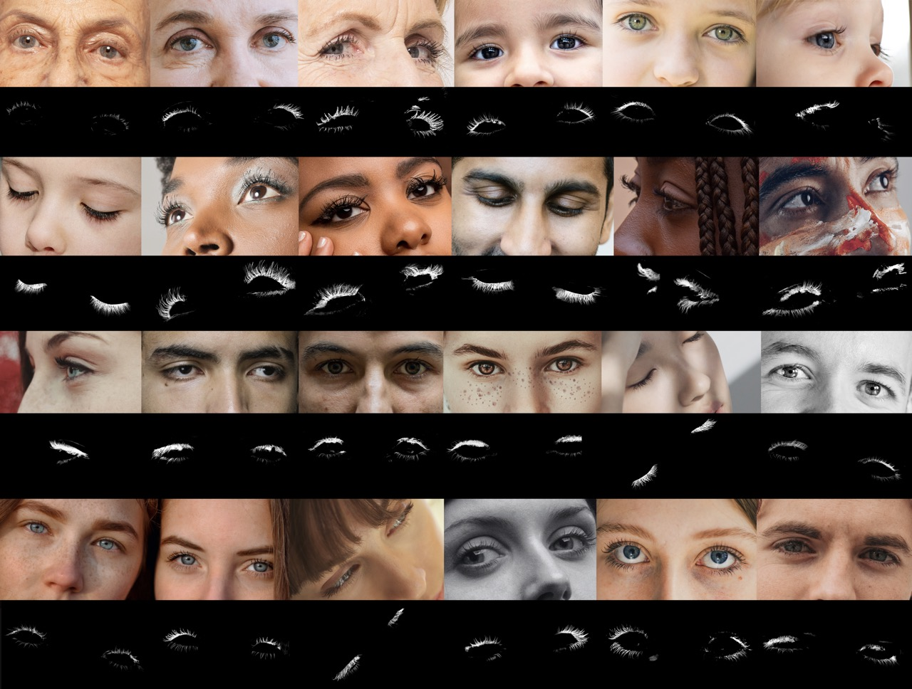

# EyelashNet: A Dataset and A Baseline Method for Eyelash Matting

Official repository for [EyelashNet: A Dataset and A Baseline Method for Eyelash Matting](http://www.cad.zju.edu.cn/home/jin/siga2021/siga2021.htm) appeared in SIGGRAPH ASIA 2021.

Eyelash matting results on daily-captured images  from [Unsplash](https://unsplash.com/.).
<p align="center">
  
</p>


## Requirements
#### Packages:
- pytorch>=1.2.0
- torchvision>=0.4.0
- tensorboardX
- numpy
- opencv-python
- toml
- easydict
- pprint
- rmi-pytorch

## Models
**The pretrained models and dataset can only be used and distributed for noncommercial purposes.**

| Model Name  |    Training Data  | File Size   |MSE|  SAD  | Grad | Conn |
| :------------- |:------|------------:| :-----|----:|----:|----:|
| [ResNet34_En_nomixup](https://drive.google.com/open?id=1kNj33D7x7tR-5hXOvxO53QeCEC8ih3-A) | ISLVRC 2012 | 166MB |N/A|N/A|N/A|N/A|
| [RenderEyelashNet](链接: https://pan.baidu.com/s/1DI6QbpabCi78VVo-NHhn1Q?pwd=w32l 提取码: w32l <br/>--来自百度网盘超级会员v5的分享) |[Render eyelashes](链接: https://pan.baidu.com/s/1LHKPLtPFqSKX1YerK2rm4Q?pwd=uhqg 提取码: uhqg <br/>--来自百度网盘超级会员v5的分享)| 288MB |  - |-|-|-|
| [EyelashNet](链接: https://pan.baidu.com/s/12SytqouM06VWC4cgAnvUAA?pwd=nj4s 提取码: nj4s <br/>--来自百度网盘超级会员v5的分享) |[Capture eyelashes](链接: https://pan.baidu.com/s/10nvS0jc_B9bZBMXf_h1OcQ?pwd=pn0p 提取码: pn0p <br/>--来自百度网盘超级会员v5的分享)| 288MB |  - |-|-|-|

- **ResNet34_En_nomixup**: Model of the customized ResNet-34 backbone trained on ImageNet. Save to `./pretrain/`. Please refer to  [GCA-Matting](https://github.com/Yaoyi-Li/GCA-Matting) for more details.
- **RenderEyelashNet**: Model trained on the rendered eyelash data. Save to `./checkpoints/RenderEyelashNet/`.
- **EyelashNet**: Model trained on the captured eyelash data. Save to `./checkpoints/EyelashNet/`.

## Train and Evaluate on EyelashNet

### Data Preparation
Download  [BaselineTestDataset](链接: https://pan.baidu.com/s/1A0ARlEK7Gg3XpnAJZ-5Ovg?pwd=oewe 提取码: oewe 
--来自百度网盘超级会员v5的分享), [EyelashNet]() , [pupil_bg](链接: https://pan.baidu.com/s/1UniX0g2iuu8A9APBygJ1Uw?pwd=2q3l 提取码: 2q3l 
--来自百度网盘超级会员v5的分享) in `./data/` folder.

Download the [coco dataset](http://images.cocodataset.org/zips/val2014.zip) in ./data/coco_bg/ folder.

### Configuration
TOML files are used as configurations in `./config/`. You can find the definition and options in `./utils/config.py`.

Set `ROOT_PATH = "<path to code folder>/"` in `./root_path.py`.

## Run a demo

```
python eyelash_test.py --config=./config/EyelashNet.toml --checkpoint=checkpoints/EyelashNet/best_model.pth --image-dir=<path to  eyelash image folder>  --output=<path to output folder>
```


### Training
We utilize a desktop PC with single NVIDIA GTX 2080 (8GB memory), Intel Xeon 3.6 GHz CPU, and 16GB RAM to train the network. First, you need to set your training and validation data path in configuration (e.g., ./config/EyelashNet.toml):
```toml
[data]
train_fg = ""
train_alpha = ""
train_bg = ""
test_merged = ""
test_alpha = ""
test_trimap = ""
```
You can train the model by 
```bash
./train.sh
```
### Evaluation
To evaluate the trained model  on BaselineTestDataset, set the path of BaselineTestDataset testing and model name in the configuration file `*.toml`:
```toml
[test]
merged = "./data/BaselineTestDataset/image"
alpha = "./data/BaselineTestDataset/mask"
# this will load ./checkpoint/*/best_model.pth
checkpoint = "best_model" 
```
and run the command:
```bash
./test.sh
```


## Acknowledgments

This code borrows heavily from [GCA-Matting](https://github.com/Yaoyi-Li/GCA-Matting).

## Citation

If you find this work, code or dataset useful for your research, please cite:

```
@article{10.1145/3478513.3480540,
author = {Xiao, Qinjie and Zhang, Hanyuan and Zhang, Zhaorui and Wu, Yiqian and Wang, Luyuan and Jin, Xiaogang and Jiang, Xinwei and Yang, Yong-Liang and Shao, Tianjia and Zhou, Kun},
title = {EyelashNet: A Dataset and a Baseline Method for Eyelash Matting},
year = {2021},
issue_date = {December 2021},
publisher = {Association for Computing Machinery},
address = {New York, NY, USA},
volume = {40},
number = {6},
issn = {0730-0301},
url = {https://doi.org/10.1145/3478513.3480540},
doi = {10.1145/3478513.3480540},
journal = {ACM Trans. Graph.},
month = {dec},
articleno = {217},
numpages = {17},
keywords = {dataset, deep learning, eyelash matting}
}
```

